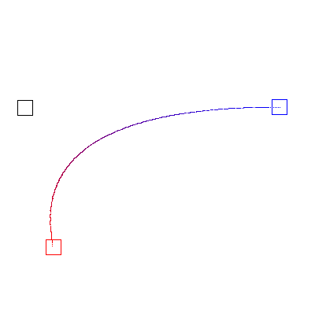

# Bezier

A simple SDL program to understand the concept of bezier curves.



## Features
1. Move the squares around to observe the changes.
2. Curve coloring.

## Compilation

```console
$ make
```

## Execution
```
$ ./bezier
```
